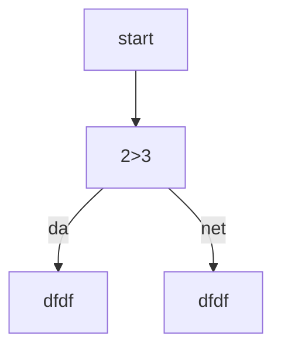

# ggg

**травников иван**

заголовки
---
# заголовок 1 уровня
## заголовок 2 уровня
### заголовок 3 уровня
#### заголовок 4 уровня
##### заголовок 5 уровня
###### заголовок 6 уровня

выделение текста
---
*курсив*
**жирный**
***курсив и жирный***
~~зачёркнутый~~
`моноширный код`

списки
---
- пункт 1
- пункт 2
- - вложенный
- - ещё
- пункт 3
- пункт4

1. пункт 1
2. пункт 2
3. пункт 3
	1. вложенный
	2. ещё

- [ ] 1
- [ ] 2
- [ ] 3

ccылки
---
[текст ссылки](https://telemost.yandex.ru/j/21244167578322)
[с подсказкой](https://telemost.yandex.ru/j/21244167578322 ":3")
<https://telemost.yandex.ru/j/21244167578322>
[ссылочный стиль][1]
[1]: https://telemost.yandex.ru/j/21244167578322

картинка
---


[

цитата
---
>цитата
>много стрк
> > вложеная

код
---
```markdown
python is shit
```

```pythom
c = a+b
print(c)
```

таблицы
---
---: = ориентация справа
:---: = ориентация справа
:--- = ориентация справа

| Name | Age | city |
| ---: | :-: | :--- |
|   ss | 34  | MOd  |
|   ss | 34  | MOd  |
|   ss | 34  | MOd  |
|   ss | 34  | MOd  |
|   ss | 34  | MOd  |
|   ss | 34  | MOd  |

линии
---
---
***
___

экранирование
---
\#
\[авпвыап\]

диаграмма
---


заголовки
---
- [заголовки](#1-заголовки)
- [списки](#3-списки)
